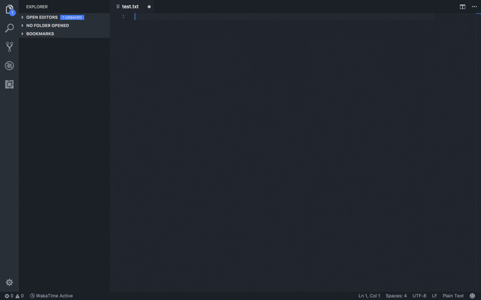

# Line Number Remover

Remove line numbers from pasted code snippets.

## Features

* `Remove Line Numbers` 
   Remove literal line numbers from selected code.
* `Paste Without Line Numbers` (<kbd>cmd/ctrl</kbd>+<kbd>shift</kbd>+<kbd>v</kbd>) 
   Paste from clipboard, automatically removing literal line numbers if present.

Example of the `Remove Line Numbers` command:

## Requirements

If you have any requirements or dependencies, add a section describing those and how to install and configure them.

* [copy-paste](https://github.com/xavi-/node-copy-paste) - `npm install -g copy-paste`

## Release Notes

### 1.0.0

Initial release of extension. No known bugs. Works as advertised.

-----------------------------------------------------------------------------------------------------------

**Enjoy!**